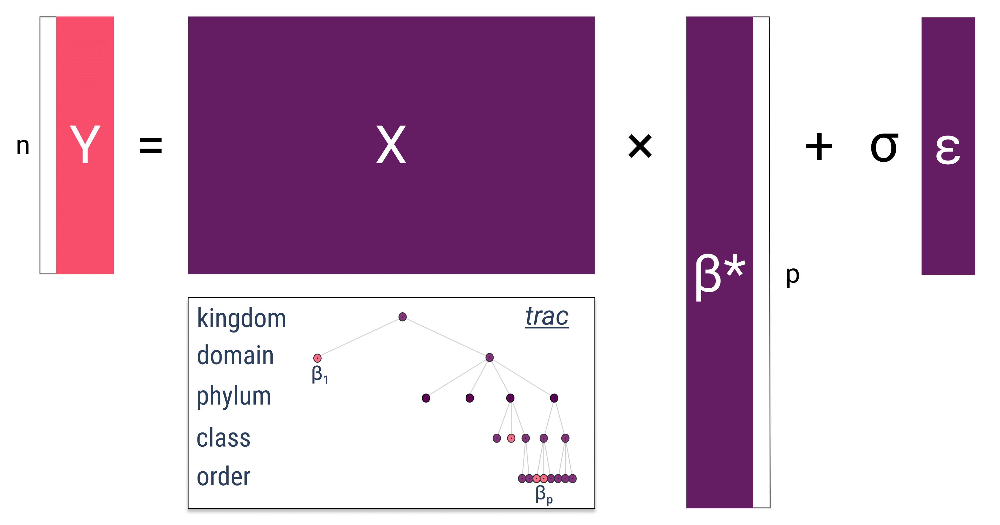

# Models Interpretation and Analysis

## Understanding Log-Contrast Model Results

Log-contrast models transform compositional data to overcome the challenges of working with constrained data that sums to a constant. The interpretation of results requires careful consideration of the log-ratio nature of the transformations.

### Regression Tasks

In regression scenarios, log-contrast models predict continuous outcomes based on compositional predictors. The coefficients represent the effect of log-ratio changes in the composition on the response variable. 

Key interpretation points:
- Coefficients indicate how a unit change in the log-contrast affects the predicted outcome
- Positive coefficients suggest that increases in the numerator taxa relative to the denominator taxa are associated with higher predicted values
- The baseline (denominator) taxa serve as the reference for all comparisons

### Classification Tasks

For classification problems, log-contrast models use compositional features to predict categorical outcomes. The model learns decision boundaries in the log-ratio space.

Important considerations:
- Feature importance reflects which log-contrasts best discriminate between classes
- Class probabilities are based on the transformed compositional space
- Interpretation should focus on relative abundance changes rather than absolute values
- Model selection procedures help assess model reliability across different compositional profiles